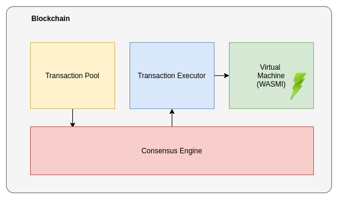
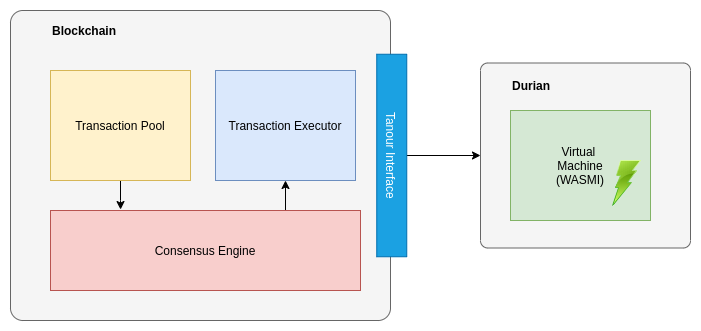
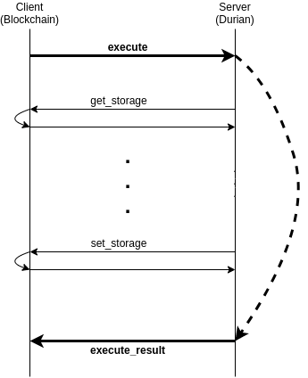
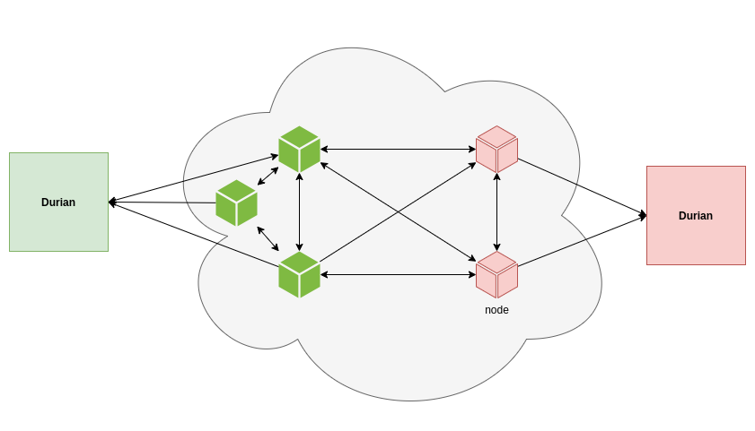

# Durian

Durian is a stateless VM based on [parity-wasm](https://github.com/paritytech/parity-wasm) for blockchains.

## Building

Durian requires **latest stable Rust version** to build. You can install Rust through [rustup](https://www.rustup.rs/).

In order to use Durian as a webservice you also need to install [Cap'n Proto](https://capnproto.org/install.html).

To build the durian from the source code, you can follow these commands:

```
$ git clone https://github.com/b00f/durian
$ cd durian

# build in release mode
$ cargo build --release
```

## How it works
Durian is a stateless WASM Virtual Machine for Blockchain. But how does it work?

A Blockchain has different parts that work together to create a chain of blocks.
Executing smart contracts is one of the fundamental components of the blockchains.



Durian aims to make a standalone Virtual Machine for blockchains to execute smart contracts
without access to the blockchain's state like accounts or block data.



For using Durian as a service, blockchain only need to implement the Durian Interface.




Durian uses Parity WASMI (Web Assembly Interpreter) to call and execute Smart contracts.
Therefore smart contracts should follow the parity WASM (PWASM) standard.

The main function in Durian is 'execute,' which accepts two input parameters. The first parameter is the transaction that includes information like sender address, gas limit, or smart contract code to be deployed or smart contract address to be called.

The second parameter is the 'Provider' interface that Durian can use to get information from the blockchain like account or block data.
If the execution is successful, Durian uses the Provider interface to update the blockchain and return the output logs. Otherwise, it immediately responds with a failure error.


## Durian as a web service

Durian can be run as a web service. In this scenario, blockchain, as a client, can call Durian to execute the smart contracts. Durian uses Cap'n Proto to implement RPC methods. The reason we chose Cap'n Proto is that it provides two-way communication between server and client. It is also faster compared to gRPC because it doesn't need to encode/decode messages between server and client.




## Examples

You can check [examples](https://github.com/b00f/durian/tree/master/examples) folder to see how a client can connect to a Durian server and deploy a simple token smart contract written by PWASM.

## License

This package is licensed under the MIT License.
